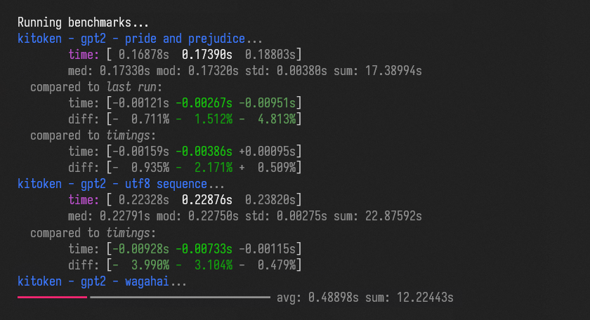

# tokenizer-bench

**Benchmark for tokenizers.**

Utility to compare the performance of different tokenizers with different datasets.



## Installation

Clone the repository and install the dependencies. Python and a package manager of choice have to be installed. Examples are given for [pdm](https://pdm-project.org) and [rye](https://rye.astral.sh/).

```shell
git clone https://github.com/Systemcluster/tokenizer-bench
cd tokenizer-bench
pdm install # or rye sync
```

This will install a common subset of tokenizers. To install all tokenizers, install the optional dependencies.

```shell
pdm install -G :all # or rye sync --all-features
```

## Usage

>[!NOTE]
>Commands given in this section omit `pdm run`, `rye run` or your command of choice to run Python in a virtual environment.

### Running benchmarks

Run the benchmark with the following command:

```shell
python -m bench
```

This will run the benchmark with all tokenizers, models and datasets, excluding combinations that are known not to complete in reasonable time. The results will be saved to the `timings` directory if not otherwise specified with the `--timings-dir` option.

Specific tokenizers, models or datasets can be selected with the `--tokenizers`, `--models` and `--datasets` options. Each option accepts a comma-separated list of names. For example, to run the benchmark with only the `kitoken` and `sentencepiece` tokenizers and the `wagahai` dataset, run:

```shell
python -m bench --tokenizers kitoken,sentencepiece --datasets wagahai
```

To exclude known slow combinations, use the `--skip-slow` option. This will exclude tokenizer, model and dataset combinations that are known to take a long time to complete. To include combinations that are known not to complete, use the `--allow-inf` option.

Run `python -m bench --help` for a full list of options.

### Showing results

To show the results of a previous benchmark run, run the following command:

```shell
python -m bench --show-results
```

The `--show-results` argument can be combined with the options to select specific tokenizers, models and datasets as described above. Use the `--timings-dir` option to specify the directory containing the results to show, and the `--compare-dir` option to compare with another set of results.

### Generating test data

To generate encoding and decoding results for tokenizer implementations, run the following command:

```shell
python -m generate
```

This will encode and decode the test data with all tokenizers and save the results in the `outputs` directory.

## Details

This benchmark measures the time it takes different tokenizers to encode inputs with different models and datasets. To ensure consistent timings, each tokenizer is, for every configuration, initialized and run in a separate subprocess with garbage collection disabled, and each subprocess is run in high-priority mode when started with appropriate permissions.

Benchmarks are run with a fixed number of iterations. The number and nature of iterations is chosen to be large enough to give a stable result, but small enough to complete in a reasonable amount of time.

The full benchmark takes a long time to complete. Use the provided options as preferred to run a subset of the benchmark. Combinations that are known not to complete in a reasonable amount of time are excluded by default unless the `--allow-inf` option is set.

A selection of results is published in the [Kitoken](https://github.com/Systemcluster/kitoken) repository.

## Tokenizers

The following tokenizers are included in this benchmark:

- [Kitoken](https://github.com/Systemcluster/kitoken) <sup>not yet published</sup>
- [SentencePiece](https://github.com/google/sentencepiece) *(doesn't complete `UTF-8 Sequence` with some models)*
- [Tokenizers](https://github.com/huggingface/tokenizers)
- [Tiktoken](https://github.com/openai/tiktoken) *(doesn't complete `UTF-8 Sequence` unless raising timeout)*
- [Tekken](https://docs.mistral.ai/guides/tokenization) *(uses Tiktoken internally)*
- [gpt_bpe](https://github.com/wbrown/gpt_bpe) *(doesn't complete `UTF-8 Sequence` with some models)*
- [llama.cpp](https://github.com/ggerganov/llama.cpp) *(optional, very slow, doesn't complete `UTF-8 Sequence`)*

This benchmark does not verify the correctness of tokenization results. Some tokenizers targeting the same model as others might produce different results for the same inputs. Use the test data generation utility to compare outputs manually if needed.

To add a new tokenizer, copy one of the existing modules in the [`bench/benches`](./bench/benches) directory and change the copy to run it. Afterwards add it to the `tokenizers` dict in [`bench/utils/bench.py`](./bench/utils/bench.py).

## Models

See the [models](./models) directory for the list of models included in this benchmark.

## Datasets

### Benchmark datasets

- **Pride and Prejudice**: A text document containing *Pride and Prejudice* by Jane Austen. This data is a good representation for common English-language inputs containing a mix of short and long paragraphs.

- **UTF-8 Sequence**: A text document containing a single-line UTF-8 sequence. This data is a good representation of inputs that might fail to split during pre-tokenization.

- **Wagahai**: A text document containing *Wagahai wa Neko de Aru* by Natsume Sōseki. This data is a good representation for Japanese-language inputs containing many long paragraphs.

### Test datasets

- **Small Input**: A text document containing a variety of short paragraphs.
- **UTF-8 Input**: A text document containing a mix of different languages and various unicode characters.
- **Mixed Input**: A large text document containing a shuffled mix of unicode characters.

See the [data](./data) directory for the contents of each dataset.
